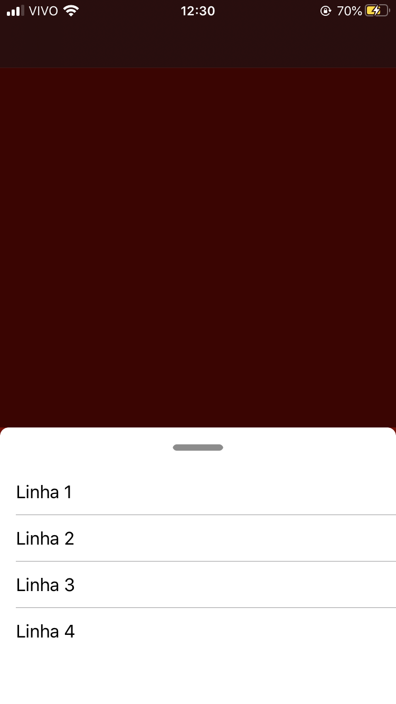
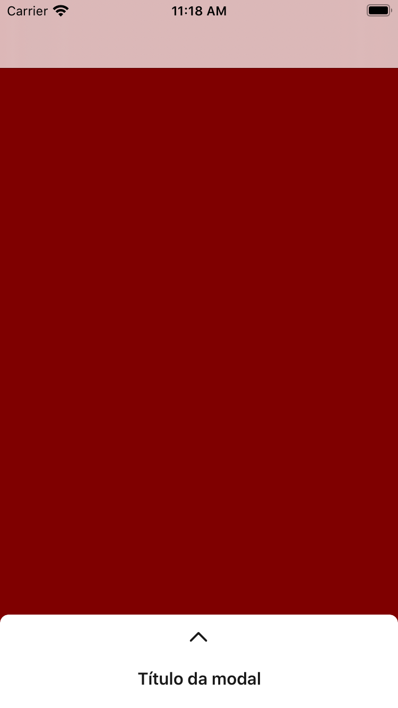
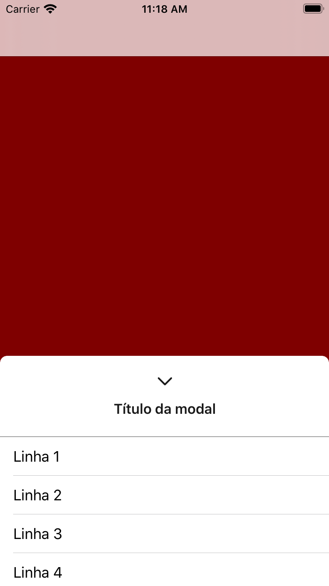

# dynamic-modal
Componente de modal em swift 5.x para ser utilizado, também, como um alerta controlado pela interação do usuário.

## Configurando a modal
Para configurá-la basta definir uma propriedade na ViewController que irá chamar o componente do tipo `ModalViewController` e no método de setup efetuar a criação sua configuração:

<pre>
    modalView = ModalViewController(withType: .modal(title: "Título da modal"), initialHeight: 88)
    modalView?.delegate = self
    modalView?.configure(in: self)
    modalView?.addView(getTableView())
</pre>

Na linha 1 o atributo `withType` define o tipo de modal a ser construído (seus tipos necessários são: .modal ou .alert). Posteriormente, ainda na linha 1 o atributo `initialHeight` é responsável pela altura de apresentação do componente, minimizado (em caso de tipo .modal) ou expandido (em caso de tipo .alert).

A linha 2 define a responsabilidade de alguns métodos de ação acionados na modal publicamente para a classe desejada, no exemplo é a própria ViewController.

Na linha 3 é acionado o método `configure(in:)`, anida estou analisando se este método é estritamente necessário, dado que já podemos considerar que quem delega é ou pode ser a classe a ser configurada mas no momento é a melhor opção no quesito de desacoplamento do componente.

Por fim, na linha 4 é acionado o método `addView()`, no qual é responsavel por receber a view que será exibida no "container" da modal (este método pode ser acionado em várias sequências afim de adicionar 'n' views).

## Exibindo a modal
Independente da configuração efetuada, para apresentar a modal, é necessário apenas a utilização do método `show`. Este método possui apenas um parâmetro opcional como callback afim de possibilitar mais ações ao executor para tomar decisões exatamente após os efeitos de transições que são acionados.

# Screen shots
#### Configuração da `presentationType = .alert`
Modal aberta              
:-------------------------:

#### Configuração da `presentationType = .modal(title: "Título da modal")`
Modal fechada              |  Modal aberta (s/background)
:-------------------------:|:-------------------------:
   |  
