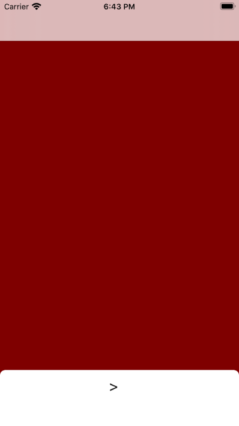
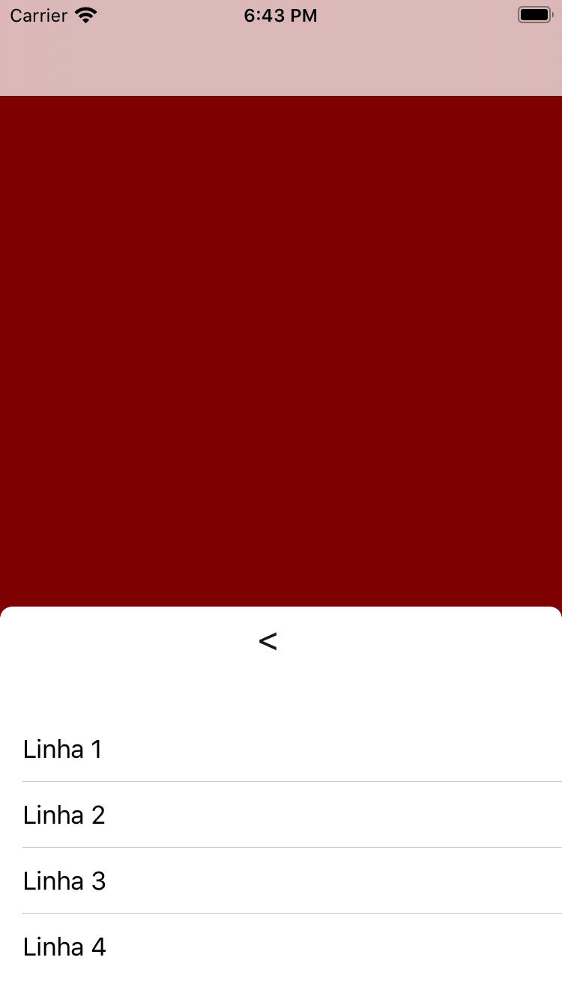

# dynamic-modal
Componente de modal em swift 5.x para ser utilizado também como um alerta controlado pela interação do usuário.

# Screen shots

Modal fechada (s/ título)

Modal aberta (s/ título)

